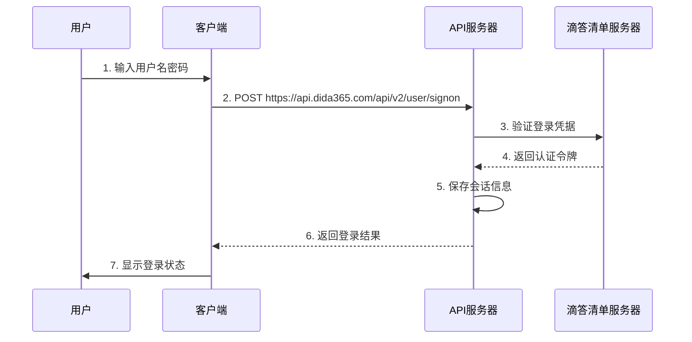
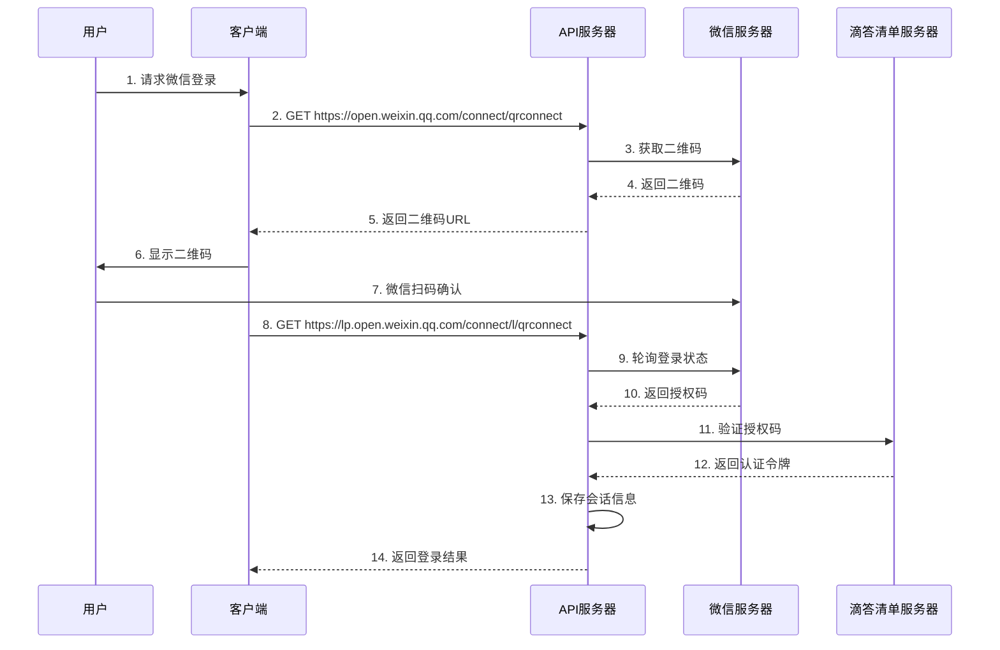

# 认证概览

滴答清单API提供两种认证方式，您可以根据使用场景选择合适的登录方法。

## 认证方式对比

| 特性 | 密码登录 | 微信登录 |
|------|----------|----------|
| **便利性** | 需要输入用户名密码 | 扫码即可 |
| **安全性** | 依赖密码强度 | 依赖微信安全体系 |
| **适用场景** | 自动化脚本、批量操作 | 交互式使用 |
| **实现复杂度** | 简单直接 | 复杂（需要轮询） |
| **网络要求** | 一次HTTP请求 | 多次请求和轮询 |
| **用户体验** | 传统表单登录 | 现代扫码体验 |

## 认证流程

### 密码登录流程

### 微信登录流程

## 详细文档

### 密码登录相关
- [密码登录](./password-login.md) - 详细的密码登录接口文档

### 微信登录相关
- [微信登录流程](./wechat-login-flow.md) - 完整的微信扫码登录流程
- [获取微信二维码](./get-wechat-qrcode.md) - 获取微信登录二维码
- [轮询登录状态](./poll-login-status.md) - 检查二维码扫码状态
- [验证微信登录](./validate-wechat-login.md) - 验证微信登录并获取令牌

