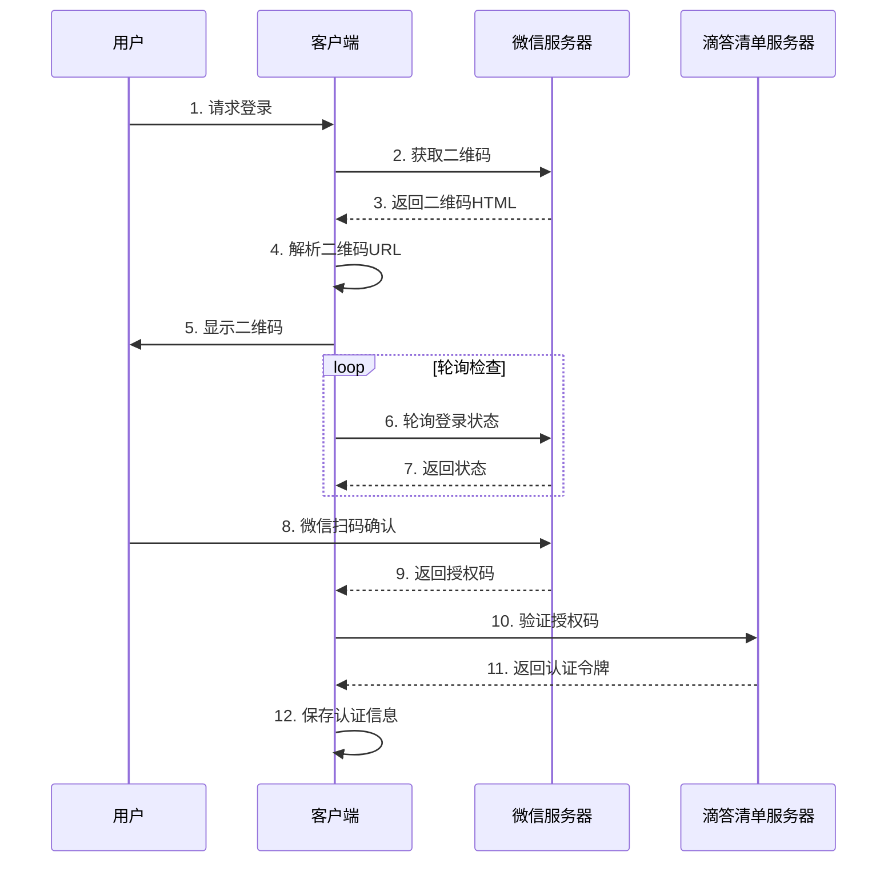

# 微信扫码登录完整流程

微信扫码登录到滴答清单是一个多步骤的过程，涉及微信开放平台和滴答清单API的协作。

## 完整流程概览



## 详细步骤

### 步骤1: 获取微信二维码
**接口**: [获取微信二维码](./get-wechat-qrcode.md)

请求微信开放平台获取登录二维码：
```http
GET https://open.weixin.qq.com/connect/qrconnect?appid=wxf1429a73d311aad4&redirect_uri=https://dida365.com/sign/wechat&response_type=code&scope=snsapi_login&state=Lw==
```

### 步骤2: 解析二维码信息
从返回的HTML中提取二维码图片URL：
```html

```

提取16位密钥：`071cfvEZ3xaPll2J`

### 步骤3: 轮询登录状态
**接口**: [轮询登录状态](./poll-login-status.md)

使用长轮询检查用户是否扫码：
```http
GET https://long.open.weixin.qq.com/connect/l/qrconnect?uuid=071cfvEZ3xaPll2J&_=1748955598000
```

### 步骤4: 用户扫码确认
用户使用微信扫描二维码并确认登录。

### 步骤5: 获取授权码
轮询接口返回授权码：
```javascript
window.wx_errcode=405;window.wx_code='001uZIkl2urXGf4qrmml2mAIWz4uZIkW';
```

### 步骤6: 验证登录
**接口**: [验证微信登录](./validate-wechat-login.md)

使用授权码向滴答清单验证登录：
```http
GET https://api.dida365.com/api/v2/user/sign/wechat/validate?code=001uZIkl2urXGf4qrmml2mAIWz4uZIkW&state=Lw==
```

### 步骤7: 获取认证令牌
验证成功后获得认证令牌和CSRF令牌：
```http
Set-Cookie: t=43A001113F9610FFC85AA97B18A297A4...; Domain=.dida365.com
Set-Cookie: _csrf_token=rMwhKGWevLOhHIhFv6hHjAziGDbkpnuY...; Domain=.dida365.com
```


## 相关接口

- [获取微信二维码](./get-wechat-qrcode.md)
- [轮询登录状态](./poll-login-status.md)
- [验证微信登录](./validate-wechat-login.md)
